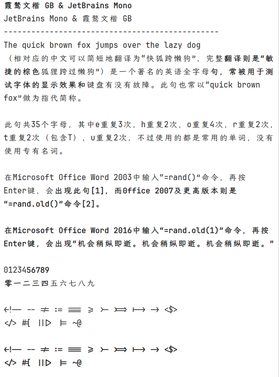

# LXGWWenKaiMonoGBAndCodeFonts

> **【自用】**`霞鹜文楷 GB` 和 其他代码字体的组合

***

## 1. Cascadia Code

[Cascadia Code v2407.24](https://github.com/microsoft/cascadia-code/releases/tag/v2407.24) 和 [LxgwWenkaiGB v1.501 24/10/10](https://github.com/lxgw/LxgwWenkaiGB/releases/tag/v1.501)

仅使用`Regular`自重，`Bold`为regular加粗而来

[CascadiaCodeNF+LXGWWenKaiMonoGB-Bold.ttf](https://github.com/iONLY100/LXGWWenKaiMonoGBAndCodeFonts/blob/main/CascadiaCodeNF/CascadiaCodeNF%2BLXGWWenKaiMonoGB-Bold.ttf) [下载](https://github.com/iONLY100/LXGWWenKaiMonoGBAndCodeFonts/raw/refs/heads/main/CascadiaCodeNF/CascadiaCodeNF+LXGWWenKaiMonoGB-Bold.ttf) = (`CascadiaCodeNF-Regular.ttf` + `LXGWWenKaiMonoGB-Regular.ttf`) * 加粗(25 , 20)

[CascadiaCodeNF+LXGWWenKaiMonoGB-Regular.ttf](https://github.com/iONLY100/LXGWWenKaiMonoGBAndCodeFonts/blob/main/CascadiaCodeNF/CascadiaCodeNF%2BLXGWWenKaiMonoGB-Regular.ttf) [下载](https://github.com/iONLY100/LXGWWenKaiMonoGBAndCodeFonts/raw/refs/heads/main/CascadiaCodeNF/CascadiaCodeNF+LXGWWenKaiMonoGB-Regular.ttf) = `CascadiaCodeNF-Regular.ttf` + `LXGWWenKaiMonoGB-Regular.ttf`

预览

- 2024-12-23
  - 添加中文标点符号
  - 优化连写字符宽度
- 2024-12-22
  - 第一次制作
***

## 2. JetBrains Mono

[JetBrains Mono v2.304](https://github.com/JetBrains/JetBrainsMono/releases/tag/v2.304) 和 [LxgwWenkaiGB v1.501 24/10/10](https://github.com/lxgw/LxgwWenkaiGB/releases/tag/v1.501)

仅使用`Regular`自重，`Bold`为regular加粗而来

[JetBrainsMono+LXGWWenKaiMonoGB-Bold.ttf](JetBrainsMono/JetBrainsMono+LXGWWenKaiMonoGB-Bold.ttf) [下载](https://github.com/iONLY100/LXGWWenKaiMonoGBAndCodeFonts/raw/refs/heads/main/JetBrainsMono/JetBrainsMono+LXGWWenKaiMonoGB-Bold.ttf) = (`JetBrainsMono-Regular.ttf` + `LXGWWenKaiMonoGB-Regular.ttf`) * 加粗(12 , 12)

[JetBrainsMono+LXGWWenKaiMonoGB-Regular.ttf](JetBrainsMono/JetBrainsMono+LXGWWenKaiMonoGB-Regular.ttf) [下载](https://github.com/iONLY100/LXGWWenKaiMonoGBAndCodeFonts/raw/refs/heads/main/JetBrainsMono/JetBrainsMono+LXGWWenKaiMonoGB-Regular.ttf) = `JetBrainsMono-Regular.ttf` + `LXGWWenKaiMonoGB-Regular.ttf`

预览

- 2024-12-23
  - 第一次制作
***
